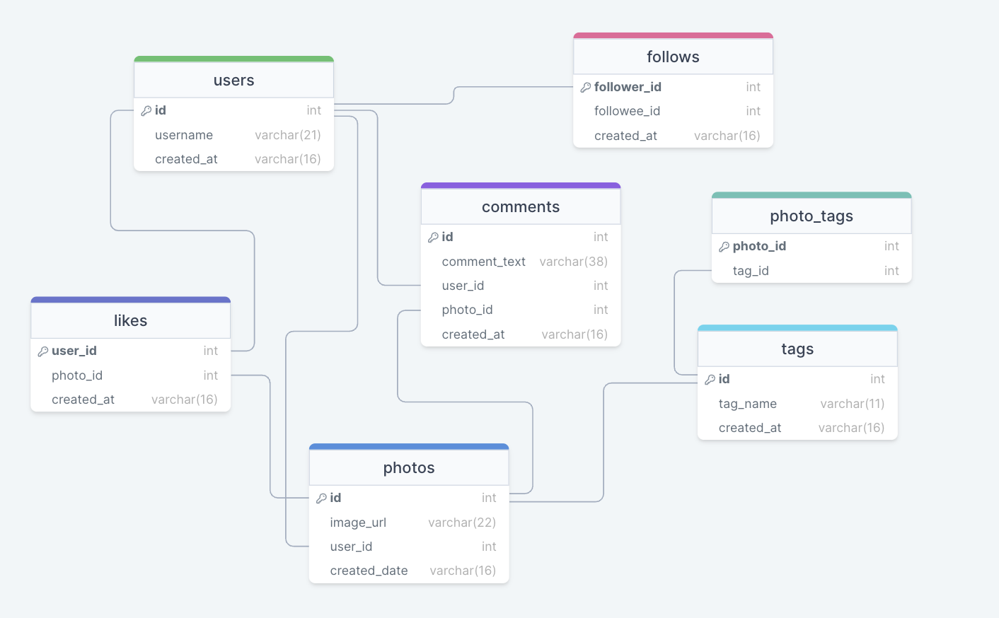

# Analysing User Behaviour on Instagram with SQL
I have worked on a project hosted by [Hi Counselour](https://hicounselor.com/projects) throught Linkedin.

I have enjoyed on this project, because this aim to improve my skills cleaning datasets, conectting to database and write some queries to get different insights from data. They gave to me CSV and I had to envolved myself for working on them. Each CSV, content each table where we are working, and we selected only the useful columns for geetting the queries...
Applying the Knowledge during my Bootcamp and data analysis, we could show insights and help businesses and stakeholders to achieve greater success on our business case and the app.



--------------------

The most useful query: 

```sql
SELECT tableA.total_A AS 'Number Of Users who never commented',
		(tableA.total_A/(SELECT COUNT(*) FROM users))*100 AS '%',
		tableB.total_B AS 'Number of Users who likes every photos',
		(tableB.total_B/(SELECT COUNT(*) FROM users))*100 AS '%'
FROM
	(
		SELECT COUNT(*) AS total_A FROM
			(SELECT username,comment_text
				FROM users
				LEFT JOIN comments ON users.id = comments.user_id
				GROUP BY users.id
				HAVING comment_text IS NULL) AS total_number_of_users_without_comments
	) AS tableA
	JOIN
	(
		SELECT COUNT(*) AS total_B FROM
			(SELECT users.id,username, COUNT(users.id) As total_likes_by_user
				FROM users
				JOIN likes ON users.id = likes.user_id
				GROUP BY users.id
				HAVING total_likes_by_user = (SELECT COUNT(*) FROM photos)) AS total_number_users_likes_every_photos
	)AS tableB;
```
